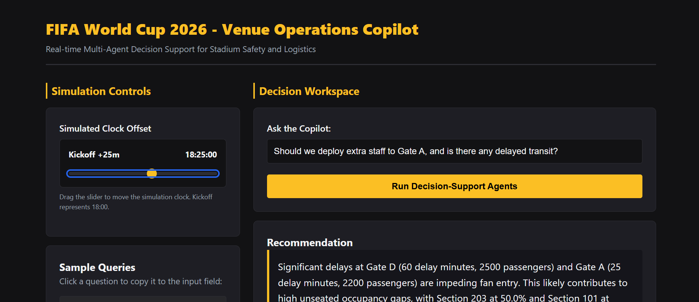
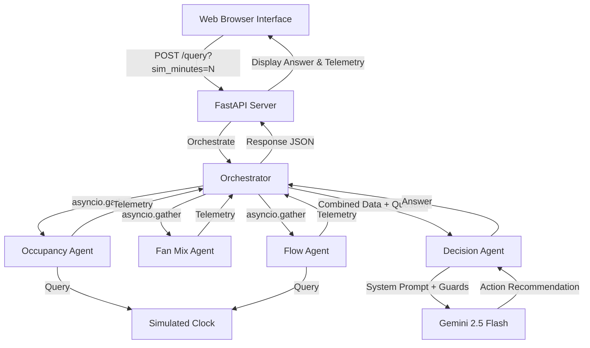

# FIFA World Cup 2026 - Venue Operations Copilot (PromptWars Challenge)



## Live Demo
- **Live Application URL**: [PLACEHOLDER - I will fill this in]
- **GitHub Repository URL**: https://github.com/BunnyPraneeth5/promptwars-venue-copilot
- **Note**: The first request after a period of inactivity may take 30–60 seconds to complete due to Render free-tier cold start behavior. This is expected and not a bug.

## Why This Is Different
Existing smart stadium tools (such as dashboards and digital twins) are passive monitoring or pre-planned simulation systems. They display static, pre-aggregated metrics on visual widgets and rely on operations staff to continuously monitor charts, manually flag anomalies, and determine appropriate responses. 

In contrast, this Venue Operations Copilot is active and query-driven. Instead of requiring the operator to parse a complex dashboard, the system processes natural language questions (e.g., *"Should we redirect transit arrivals?"*). The system dynamically queries and aggregates simulated live telemetry from three concurrent context agents in real time, correlates this information, and uses Gemini 2.5 Flash to generate a single, reasoned, actionable recommendation under 150 words.

## Core Approach and Logic
The copilot addresses two major tournament safety challenges:
1. **Rival Fan Section Mixing**: Preventing opposing, high-intensity fan sections from mixing beyond safe density thresholds.
2. **Ticketed vs. Actual Seat Presence**: Identifying discrepancies between ticket scans (turnstile entries) and actual concourse/seat presence to detect dangerous concourse bottlenecks.

## System Architecture and Workflow
The diagram below shows the query-driven flow: an operator's natural language question triggers three parallel context agents, which converge into a decision agent for a single reasoned recommendation.



1. **Simulated Clock (`app/clock.py`)**: Uses context variables to manage request-scoped simulation offsets (`?sim_minutes=N`). The clock's kickoff is set to a constant reference time (`2026-06-15 18:00:00`) independent of the server's real wall-clock, ensuring data consistency for judges at any date.
2. **Occupancy Agent (`app/agents/occupancy_agent.py`)**: Compares turnstile scans against estimated seated presence to detect concourse build-ups.
3. **Fan Mix Agent (`app/agents/fan_mix_agent.py`)**: Evaluates section ticket distributions to compute rival fan density risk.
4. **Flow Agent (`app/agents/flow_agent.py`)**: Predicts gate bottleneck windows by correlating delayed transit schedules with upcoming kickoff/halftime surges.
5. **Provider Registry (`app/provider_registry.py`)**: Maintains agent operational states (`ACTIVE`, `DEGRADED`, `DISABLED`). If any agent fails or times out, the orchestrator registers it as `DEGRADED` and continues utilizing the remaining agents without crashing.
6. **Decision Agent (`app/agents/decision_agent.py`)**: Feeds gathered data and the user query to Gemini 2.5 Flash. It uses a rigorous system instruction set to act as a prompt-injection guardrail, ensuring user questions are treated purely as *data* rather than commands. Answers are restricted to under 150 words and conclude with one concrete action.

## How to Run Locally

### Prerequisites
- Python 3.11 or Python 3.12 installed.
- A Gemini API key.

### Setup and Running
1. Clone the repository and navigate to the directory:
   ```bash
   cd promptwars-venue-copilot
   ```

2. Create a virtual environment and activate it:
   ```bash
   python -m venv venv
   # On Windows (PowerShell):
   .\venv\Scripts\Activate.ps1
   # On macOS/Linux:
   source venv/bin/activate
   ```

3. Install dependencies:
   ```bash
   pip install -r requirements.txt
   ```

4. Create a `.env` file in the root directory and add your Gemini API Key:
   ```env
   GEMINI_API_KEY=your_actual_gemini_api_key_here
   ```

5. Run the FastAPI server:
   ```bash
   python -m uvicorn app.main:app --host 0.0.0.0 --port 8000 --reload
   ```

6. Open your web browser and visit:
   `http://localhost:8000/` (which automatically redirects to `/static/index.html`)

## Running Automated Tests
Run the test suite using pytest to verify agent calculations, simulated clock offsets, API endpoints, rate limiting, and agent error-isolation:
```bash
python -m pytest
```

## Deployment Instructions
This app is optimized to deploy directly on free-tier platforms such as Render, Railway, or Fly.io:
1. **Deploying on Render**:
   - Create a new Web Service linked to your repository.
   - Select Python as the environment.
   - Use Build Command: `pip install -r requirements.txt`
   - Use Start Command: `python -m uvicorn app.main:app --host 0.0.0.0 --port $PORT`
   - In Environment Settings, add key `GEMINI_API_KEY` with your API credentials.

## Critical Assumptions
- **Mock Data**: Since real-time stadium sensor feeds, turnstile gates, and transit arrival logs are not publicly accessible, all data inputs are simulated.
- **Simulated Clock**: A simulated clock is intentionally implemented rather than using the system's real datetime. This guarantees that whenever an evaluator runs the project (regardless of timezone, date, or year), the timeline aligns perfectly with the mock data offsets.

## Known Limitations
- **Simulated Data**: All input feeds (turnstiles, ticketing, and transit schedules) are mock datasets since real stadium sensor streams are not publicly available.
- **Hosting Cold Start**: If hosted on a free-tier server, the application may take 30–60 seconds to spin up on the initial request after a period of inactivity.
- **Non-Persistent Rate Limiting**: The sliding-window rate limiter runs entirely in-memory and will reset whenever the backend server restarts.
